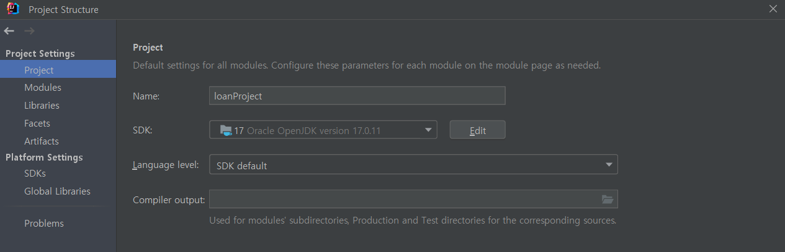
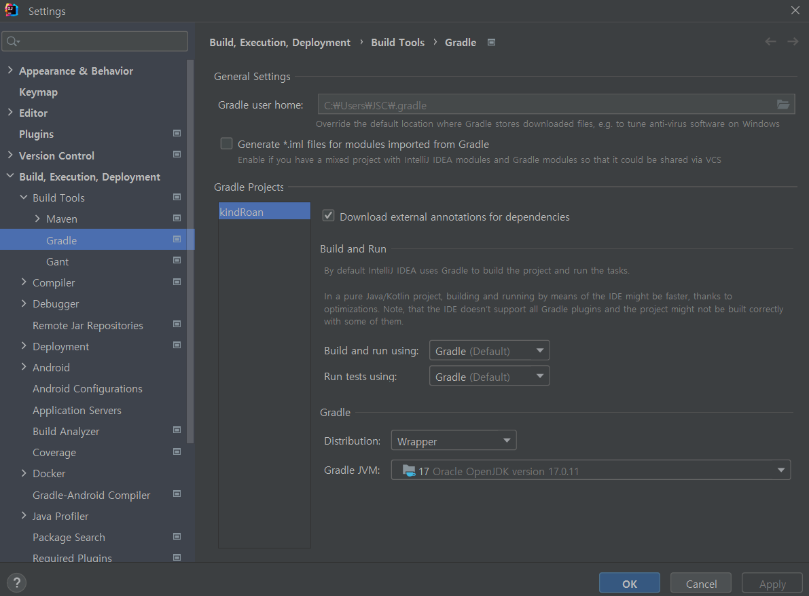

## Unsupported class file major version X 의 해결방법

노트북을 변경한 이후, Github에서 프로젝트를 새 컴퓨터로 옮겨서 작업하는 도중 한 오류가 나타났습니다.

Unsupported class file major version 66이라는 오류가 나타났는데 해당오류는 JRE의 해당버전이 정상적으로 실행되지 않아서 발생한 오류입니다.

Unsupported class file major version X에서 X는 버전의 번호를 이야기합니다.

JAVA SE 22 = 66, JAVA SE 21 = 65, JAVA SE 20 = 64 이런식과 동일합니다. (버전의 참조사항은 해당 페이지 아래의 해당 오류 해결 참조를 클릭해서 버전의 번호를 참조해주세요)

Intellij 에서 해결하기 위해서는 File > Project Settings에서 Project SDK를 프로젝트에 맞는 SDK로 변경합니다.

또한, File > Settings 에서 gradle에서도 SDK의 버전을 변경해야 합니다.

[해당 오류 해결 참조](https://github.com/react-native-community/cli/issues/2348)

