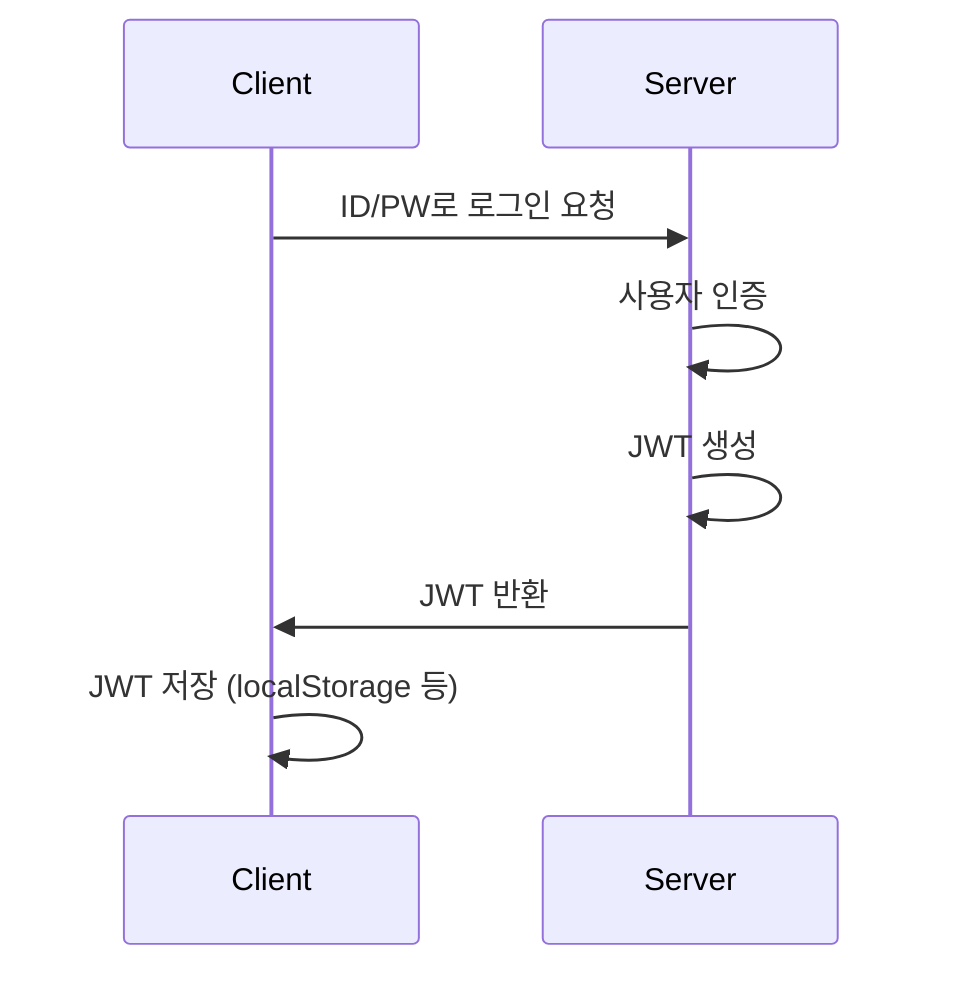
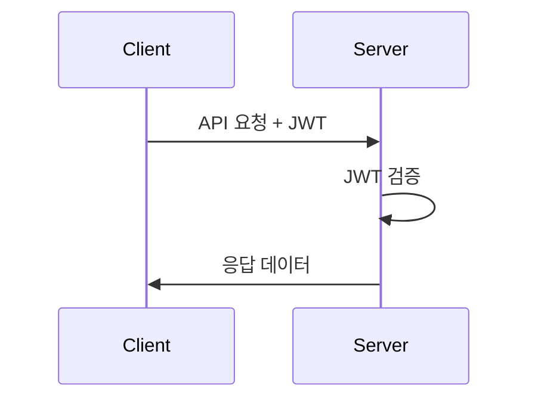

웹사이트를 개발하는 도중에, 회원가입과 로그인을 만드는 도중 보안 관련이 굉장히 중요하다고 생각되었는데, 보안을 위해 JWT를 적용해야 된다는 말을 들었습니다.
제가 JWT를 알지 못했었는데, 배움을 정리하고, 제가 이해한 내용을 남들도 쉽게 이해하기 위해서 만들었습니다.

## 1. JWT란 무엇인가?

JWT는 JSON Web Token의 약자로, 당사자간 정보를 JSON 형태로 안전하게 전달하기 위한 토큰입니다. 
쉽게 말해, 서버가 클라이언트에게 발급해주는 "디지털 통행증"이라고 생각하면 됩니다.

### 실제 사용 예시
```
# 실제 JWT 토큰 형태
eyJhbGciOiJIUzI1NiIsInR5cCI6IkpXVCJ9.
eyJzdWIiOiIxMjM0NTY3ODkwIiwibmFtZSI6IkpvaG4gRG9lIiwiaWF0IjoxNTE2MjM5MDIyfQ.
SflKxwRJSMeKKF2QT4fwpMeJf36POk6yJV_adQssw5c
```
(위는 그냥 예시일 뿐입니다.)


[jwt 참조사이트](https://jwt.io/) 


## 2. JWT의 구성 요소

JWT는 세 부분으로 구성되며, 각 부분은 점(.)으로 구분됩니다:
``` 
(Header).(Payload).(Signature)
XXXXX.YYYYY.ZZZZZ
```

### 1) 헤더 (Header)
```json
{
  "alg": "HS256",    // 서명 알고리즘
  "typ": "JWT"       // 토큰 유형
}
```

### 2) 페이로드 (Payload)
실제로 전달하고 싶은 정보를 담는 부분입니다.


```json
{
  // 등록된 클레임 (표준 클레임)
  "iss": "jsc5023.com",         // 발급자
  "sub": "jsc@example.com",    // 제목
  "iat": 1516239022,           // 발급 시간
  "exp": 1516242622,           // 만료 시간

  // 개인 클레임 (커스텀 클레임)
  "userId": "jsc",
  "role": "admin"
}
```

### 3) 서명 (Signature)
```javascript
HMACSHA256(
  base64UrlEncode(header) + "." +
  base64UrlEncode(payload),
  secret_key
)
```


## 3. JWT 동작 방식

1. **로그인 과정**


2. **API 요청 과정**



## 4. JWT의 장단점

### 장점과 단점

| **장점**                                                                                                               | **단점**                                                                                                                |
| ---------------------------------------------------------------------------------------------------------------------- | ----------------------------------------------------------------------------------------------------------------------- |
| - 세션으로 저장하지 않아서, 서버 저장공간에 부담이 적습니다다. <br>- 로컬에 저장되어 있어서서 DB 조회 가 필요없습니다. | - 세션 ID보다 커서 로컬에는 부담이 가해질 수 있습니다. <br>- 모든 요청에 포함되어 네트워크에 부하가 증가할 수 있습니다. |
| - 서버가 여러 대여도 문제가 없습니다. <br>- 다른 서비스와의 연동이 쉽습니다.                                           | - 클라이언트에서 처리하기 때문에 사용자 자체에 문제가 생겼을 경우, 문제가 됩니다다.<br>                                 |
